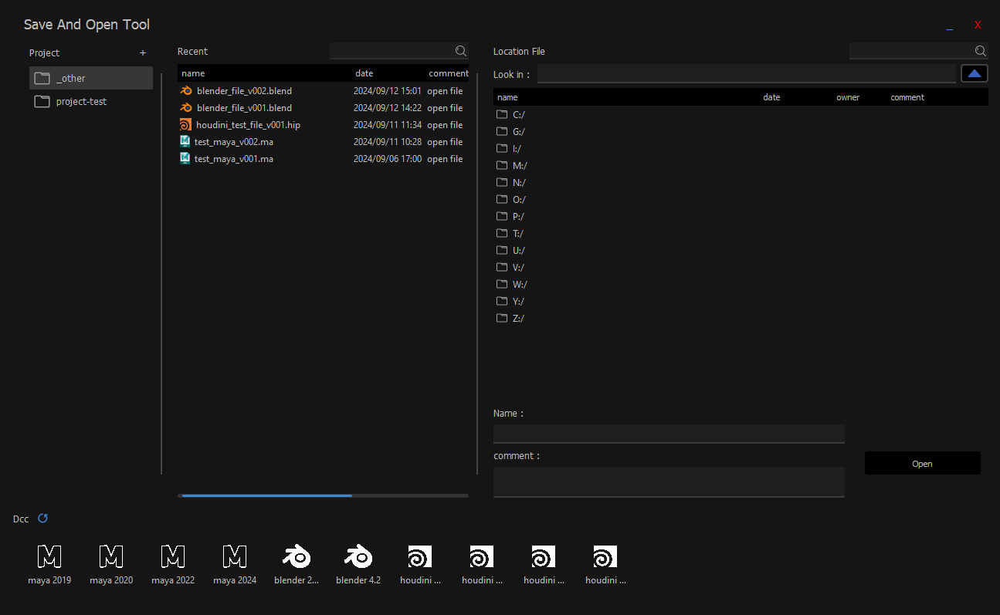

# Save And Open Tool by Tsp
save and open file support: maya, houdini, blender</br>
* open program maya, houdini, blender if program install in drive C
* crate project for group file
* record recent file
* comment on file


## Requirements
* Python 3 for open **standalone tool**
* Pyside 2
* **Maya 2018** and above
* **Houdini 19** and above
* **Blender 2** and above

## How to Use
### Call Function UI
```python
import sys
import platform

# Setup Python Version
#---------------------
PY_VERSION = int(platform.python_version().split('.')[0])
if PY_VERSION == 3:
	from importlib import reload

PATHS = [ 'D:/path/dirname/tool' ]
for path in PATHS:
    if not path in sys.path:
        sys.path.append(path)

import tsp_saveAndOpen_tool.saveAndOpen_ui as sao_ui
reload(sao_ui)

sao_ui.main()
```
### **Standalone Tool**</br>

Description</br>

* **1** : show project name 
* **2** : show recent file
* **3** : show location folder and file in path
* **4** : show program if install in **drive C**</br>
### **In Program**
don't show program if open in maya, houdini, blender

same with standalone tool but
* **1** : add show save button for save file</br></br>

### Add Project
create project for manage group file in tool</br>

* select project when save for manage group
* **name** : name project
* **path** : path default project</br>

when click one project will show file list in path default


### Open Program
* double click on icon for open program 
* hover on icon for see full name


### In Program
* show only file extension match with program

* when select file name and comment will show in box

* name file in box must be **extension file** ex. [maya_file.ma, houdini_file.hip, blender_file.blend]
 